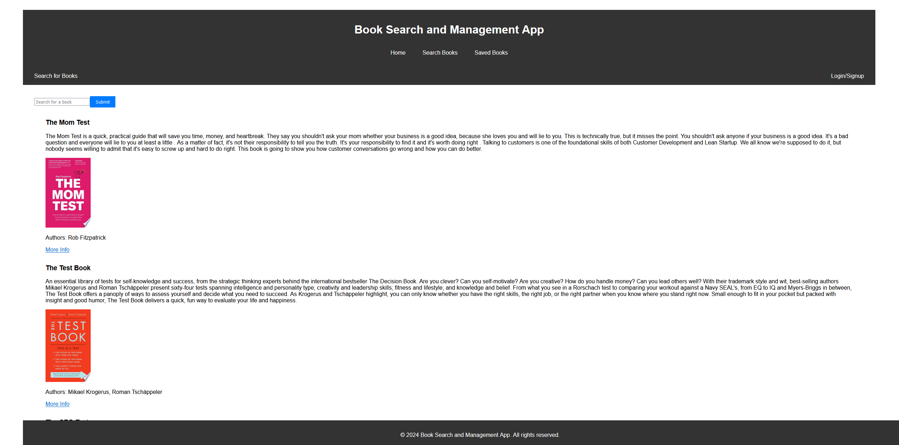

# Book Search Engine and Manager



This is a full-stack application that allows users to search for books using the Google Books API and manage a list of saved books. The application is built using React for the front-end, Apollo Client for managing GraphQL queries and mutations, and MongoDB for the database. The back-end is implemented with Express and Apollo Server to handle GraphQL queries and mutations.

## Deployed Application

Check out the live application [here](https://your-deployed-app-url.com).

## Features

- **User Authentication**: Users can sign up and log in to manage their book lists.
- **Book Search**: Users can search for books using the Google Books API.
- **Save Books**: Logged-in users can save books to their personal list.
- **Remove Books**: Users can remove books from their saved list.
- **Responsive Design**: The application is fully responsive and works on all devices.

## Technologies Used

- **Front-End**:
  - React
  - Apollo Client
  - GraphQL
  - HTML/CSS
- **Back-End**:
  - Node.js
  - Express.js
  - Apollo Server
  - MongoDB
  - Mongoose
- **Authentication**:
  - JWT (JSON Web Tokens)

## Installation

1. Clone the repository:
```bash
   git clone https://github.com/yahm0/Book-Search-Engine
   cd book-search-app
```

2. Install server dependencies:
```bash
    cd server
    npm install
```

3. Install client dependencies:
```bash
cd ../client
npm install
```

4. Create a .env file in the root directory of the project with the following content:
```bash
MONGODB_URI=mongodb://localhost:27017/yourdbname
JWT_SECRET=your_jwt_secret
```

## Usage

1. Start the server:

```bash
cd server
npm start
```

2. Start the client:

```bash
cd ../client
npm start
```

3. Open your browser and go to http://localhost:3000.

## License

This project is licensed under the **MIT License**.

 - Feel free to customize the URLs, repository names, and additional information specific to your project. Make sure to include the actual screenshot image in the `client/public/` directory with the filename `screenshot.png`, or adjust the path to where your screenshot is located.
